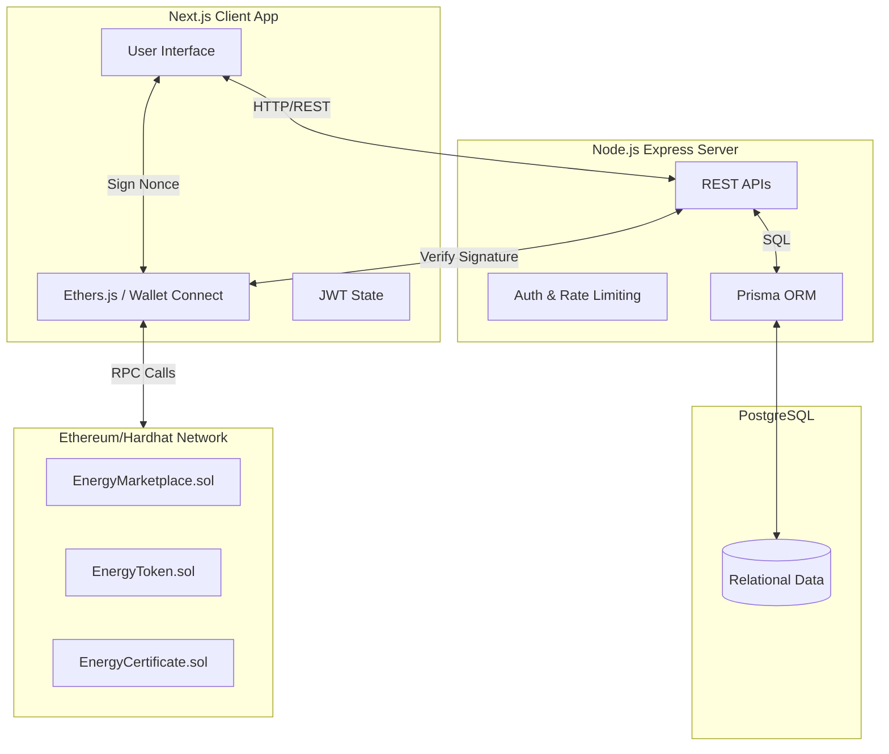
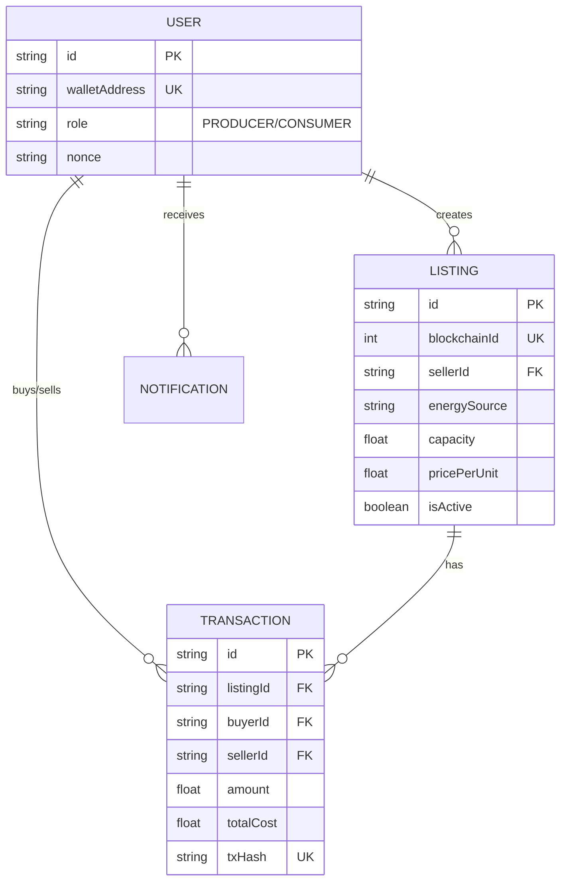
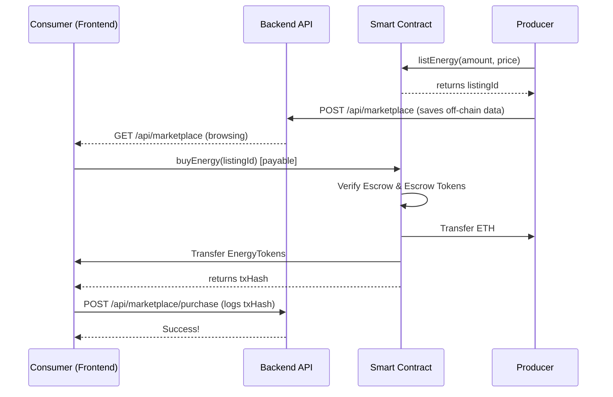

# Platform Architecture & UML Diagrams

This document contains the structural blueprints of the VoltExchange platform, satisfying the requirement for UML, ER, and Architecture diagrams.

## 🏗️ 1. High-Level System Architecture

The platform uses a hybrid on-chain/off-chain model to maximize efficiency.

## 🗄️ 2. Entity Relationship (ER) Diagram

This represents the `schema.prisma` database structure.

## 🔄 3. Purchase Sequence Flow

The flow of a consumer buying energy from a producer.

